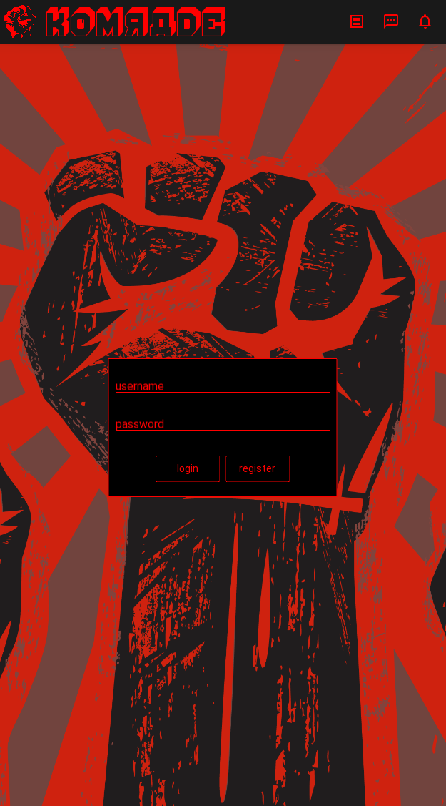
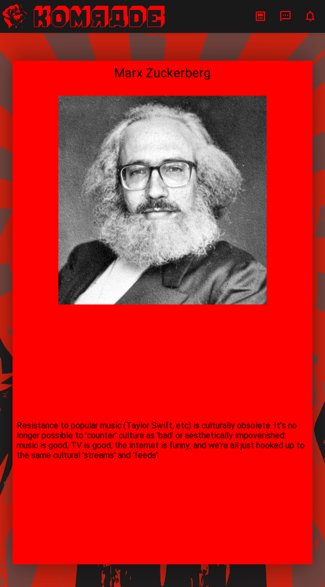

# Komrade

Komrade is a social*ist* network. It is predicated on anti-capitalist and anti-racist principles of freedom and solidarity.

## Why another social network?

Much of our life today is lived on social networks owned and operated by two or three of the largest, multinational companies in the world. These companies harvest every click of our digital lives, stretching back 20 years now; they listen through our phones; they squeeze every last drop of profit out of us. In the process, newspapers are destroyed, writers become 'content producers'; algorithms reinforce racist and gender inequalities. These platforms have become the infrastructure of all social life, and yet they are privately owned by a handful of out-of-touch white male billionaires. 

But we don't need them. The technology is simple. We can make our own social network: a socialist network. One that is private, secure, insurveillable, unmonetizable; one which would give people the security they need to communicate about whatever they want, including protesting against capital and the state.

## Features

### Your traffic is untraceable

All traffic is routed via [Tor](https://www.torproject.org/), a global maze of computers so dense that even the FBI can't trace your footsteps. And what's untraceable is also unmonetizable: your data can't be harvested by technology companies and used for advertising algorithms. You're protected from both surveillance capitalism and the surveillance state.

### Be as anonymous as you wish

Design a profile and account which is as anonymous as you want to make it. If you don't reveal yourself, your traffic or behavior elsewhere on the internet won't either.

### Best of what's out there

We present a simplified set of social media features drawn from everything that's out there and then some:

* Profile
  * Curate a profile with photo and posts (e.g. Twitter)
  * Show profile to world (e.g. Twitter)
  * Show profile only to friends (e.g. Facebook)
  * Show profile only to your local area (e.g. Nextdoor)

* Posting 
  * Post to the entire world (e.g. Twitter)
  * Post to your friends (e.g. Facebook)
  * Post to your surrounding area by a distance radius (e.g. Nextdoor)
  * Anonymously up-vote or down-vote posts (e.g. Reddit)
  * Post anonymously or from your account (new)

* Organizing
  * Host events and invite others (e.g. Facebook)
  * Host events like protests anonymously (new)
  * Anonymously pin on a map sites of danger, like police (e.g. Waze)

* Messaging
  * Message securely with encrypted contents (e.g. Signal)
  * Message securely with untraceable metadata (new)

### Open-source and community run

Not just non-profit, we're anti-profit.

## Progress

### Screens

#### Login screen

Got this working on front and backend.

#### Post

Experimenting with posts as 'cards', kind of like Tinder, which you can swipe up to up-vote or amplify, swipe down to down-vote or dampen, swipe left to see the next card and swipe right to see the previous. A horizontal feed basically. One image or video allowed; up to N words allowed; maybe a title? Design is horrendous so far, needs work. 

## Technical details

Design details are changing rapidly, but these are what we have so far.

### App

The 'client' or app is made with [KivyMD](https://github.com/kivymd/KivyMD), a variant of [Kivy](https://kivy.org/), a cross-platform mobile development framework in Python. Python is an easy and versatile progamming language to learn, which keeps the code accessible to as many people as possible.

### Server

The server also runs on Python, serving a graph database powered by [Neo4j](https://neo4j.com/).