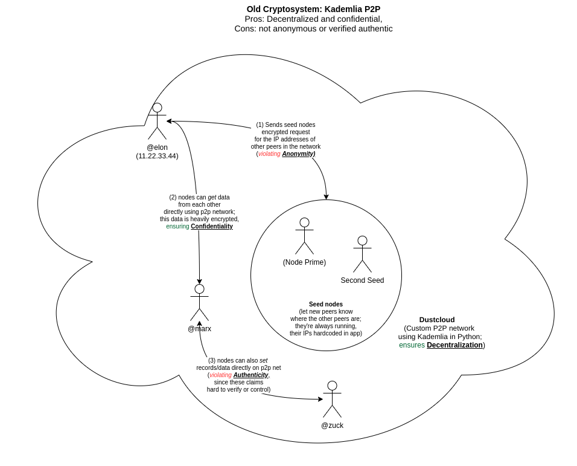
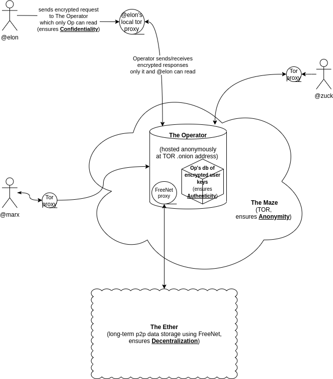

# Komrade

Komrade is a socialist network. It seizes the means of digital production.

## Why another social network?

Is a 'socialist network' possible? Although the internet began with anarchic design principles, it quickly consolidated into the hands of a few of the largest corporations in the world. It has effectively recreated the capitalist mode of production within itself: the means of content production (social media platforms) are privatized while the work of production (posting) remains socially distributed. Exploitation inheres in that relation, whether in the industrial factory or the digital platform, because the value you produce is taken from you, concentrated and privatized.

But a digital network can be redesigned. The technology behind these social media platforms is actually quite simple. We can easily build our own social network, one which is secure, insurveillable, and unmonetizable—one which would give people the security they need to communicate about whatever they want, including protesting against capital and the state..

## Core principles

### Private

All of your data are strongly encrypted end-to-end: only you and those you write to can decrypt and read it. To anyone without the right decryption 'key', the data is nonsense.

### Anonymous

All network traffic is routed through Tor, a "deep web" maze of computers so dense even the FBI can't follow you through it. The "Operator" or the central server for the app is accessible only from this deep web. It's impossible to tell who is sending what to whom, or even who is using the app at all.

### Unmonetizable

What's untraceable is also unmonetizable: your data can't be harvested by technology companies and used for advertising algorithms. You're protected from both surveillance capitalism and the surveillance state.

### Decentralized

Data is deleted as soon as possible from Komrade. The remote Operator simply delivers the mail: incoming messages are stored in the inboxes for the accounts written to, but as soon as these accounts download their mail, they're deleted from the internet forever. Messages to a group inbox or 'channel' delete as soon as their founding member downloads them; from there they travel (encrypted end-to-end) through the web of trust through which members joined the group.

### Webs of trust

Group accounts or 'collectives', like @portland or @socialists, grow as existing members 'vouch for' new ones. Other komrades can see how many times a given person has been vouched for, both within a group and overall, but not who has vouched for them. In order to join a group, at least one member must vouch for you; this minimum (or 'quorum') may grow as the group grows.

### Anti-profit

Not just non-profit, we're anti-profit.

### Open-source

Information wants to be communist.

## Social media features

We present a simplified set of social media features drawn from everything that's out there:

#### Profile
  * Curate a profile with photo and posts (e.g. Twitter)
  * Show profile to world (e.g. Twitter)
  * Show profile only to those you trust (e.g. Facebook)
  * Show profile only to your local area (e.g. Nextdoor)

#### Posting
  * Post up to 1 image and/or 1000 characters
  * Post to the entire world (e.g. Twitter)
  * Post to those you trust (e.g. Facebook)
  * Post to your surrounding area by a distance radius (e.g. Nextdoor)
  * Anonymously up-vote or down-vote posts (e.g. Reddit)
  * Post anonymously or from your account

#### Organizing
  * Host events and invite others (e.g. Facebook)
  * Host events like protests anonymously (new)
  * Anonymously pin on a map sites of danger, like police (e.g. Waze)

#### Messaging
  * Message securely with encrypted contents (e.g. Signal)
  * Message securely with untraceable metadata (new)


## Progress

### Preview animation

As of the 23rd of August.


### Backend preview

See [here](https://www.dropbox.com/s/8r8gqgfswojmtwd/komrade-terminal-preview--2020-09-13.mkv?dl=0).

## Design

### Old design: decentralized

After a good discussion at /r/privacy [here](https://www.reddit.com/r/privacy/comments/ii4zw9/introducing_komrade_a_decentralized/), problems in the fully decentralized model originally proposed were pointed out.



Here's a diagram I made of the old system. It's thoroughly decentralized -- there's no central server at all, just a few 'seed nodes' which let the user know where the other nodes are. But P2P systems generally require knowing the IPs of other users (so: not Anonymous). And that also allows any node to write data to network, and potentially overwhelm the true information with false information (so: no guaranteed Authenticity).

### New design: demi-centralized



Here's the new system. The downside is it's now only half decentralized. The upside is it's fully anonymous, confidential, and its authenticity can be verified. Users route all requests to a central server called the Operator (so not decentralized). But these requests are end-to-encryped (so confidential), and they're routed through the the global Tor "Maze" via the user's local Tor proxy (so it's Anonymous, all IP addresses masked). Only the Operator knows the address of other users, keeping encrypted versions of their keys which are necessary to know where they are, how to write to them, and even how to manage their settings [blocked users, etc]. That ensures authenticity of users (it acts like a PGP keyserver). Also, only the Operator can access and decrypt the (non user key related) data which it uploads to "The Ether", which would be Freenet or some other global p2p data store; so in fact all data's authenticity can be proved, not just user data.


## Technical details

Design details are changing rapidly, but these are what we have so far.

### App

The cross-platform app is made with [KivyMD](https://github.com/kivymd/KivyMD), a variant of [Kivy](https://kivy.org/), a cross-platform mobile development framework in Python. Python is an easy and versatile progamming language to learn, which keeps the code accessible to as many people as possible.

### Cryptography

We are using [Themis](https://github.com/cossacklabs/themis), a high-level cross-platform cryptography library, for all cryptographic functions, rather than handling any primitives ourselves.

### API and terminal app

All simple object-oriented stuff in Python.

### Database

The database is a simple key-value store written in Python, "simplekv".

## Install

### As developer

The usual installation:

```
git clone https://github.com/quadrismegistus/Komrade.git
cd Komrade
. script/bootstrap
```

~~Then run the client:  (this is broken temporarily)~~
```
cd client
./run.sh
```

Run the terminal client:

```
python komrade/cli/cli.py
```

### As user

Coming soon. 
