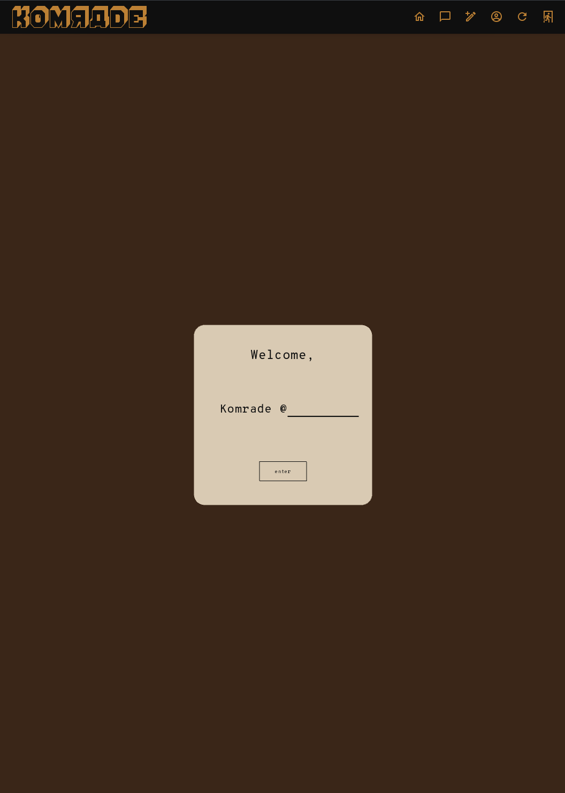
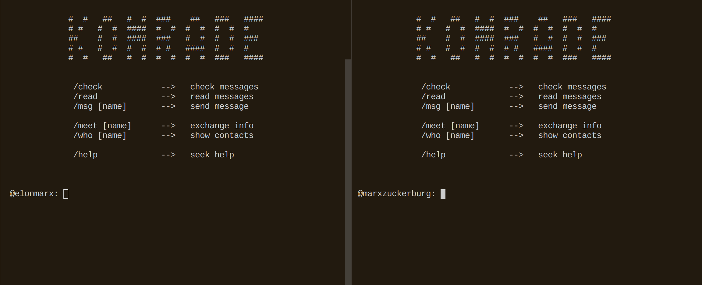
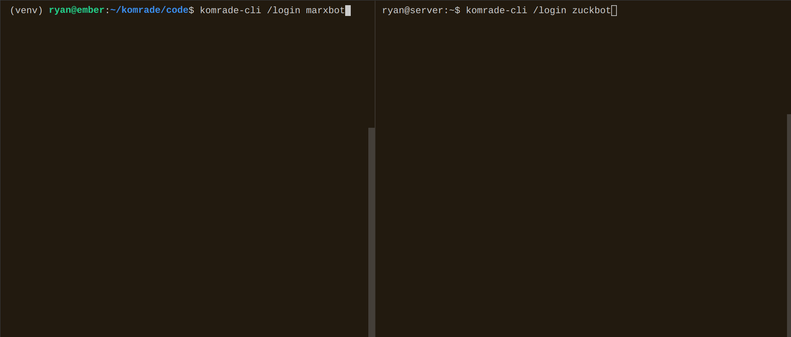

# Comrad

Comrad is a social*ist* network: encrypted, insurveillable, unmontizeable, and self-governing. Meet fellow comrades and message them securely, organize safely into self-moderated groups, plan demonstrations secretly and spontaneously – and help fight back against the police state and surveillance capitalism, both online and off.

## Why another social network?

Is a 'socialist network' possible? Although the internet began with anarchic design principles, it quickly consolidated into the hands of a few of the largest corporations in the world. It has effectively recreated the capitalist mode of production within itself: the means of content production (social media platforms) are privatized while the work of production (posting) remains socially distributed. Exploitation inheres in that relation, whether in the industrial factory or the digital platform, because the value you produce is taken from you, concentrated and privatized.

But a digital network can be redesigned. The technology behind these social media platforms is actually quite simple. We can easily build our own social network, one which is secure, insurveillable, and unmonetizable—one which would give people the security they need to communicate about whatever they want, including protesting against capital and the state.

## Core principles

### Confidential

All of your data are strongly encrypted end-to-end: only you and those you write to can decrypt and read it. To anyone without the right decryption 'key', the data is nonsense.

### Untraceable

All network traffic is routed through Tor, a "deep web" of computers so dense even the FBI can't follow you through it. Comrad's "Operator" or central server is accessible only from Tor. It's impossible to tell who is sending what to whom, or even who is using the app at all.

### Unmonetizable

What's untraceable is also unmonetizable: your data can't be harvested by technology companies and used for advertising algorithms. You're protected from both surveillance capitalism and the surveillance state.

### Democratized

Group accounts or 'collectives', like @portland or @socialists, grow as existing members 'vouch for' new ones, forming webs of trust. In order to join a group, at least one member must vouch for you; this minimum (or 'quorum') may grow as the group grows, or in accordance with a 'constitution' which the group votes upon.

### (Semi-)decentralized

Data is deleted as soon as possible from Comrad. Comrad's "Operator" simply sorts and holds the mail temporarily: as soon as users log in to download their mail, the messages are deleted from the server and network forever.

### Open-source

Information wants to be communist.

### Anti-profit

Not just non-profit, we're anti-profit.


## Social media features

We present a simplified set of social media features drawn from everything that's out there:

#### Profile
  * Curate a profile with photo and posts (~Twitter)
  * Show profile to world (~Twitter)
  * Show profile only to those you trust (~Facebook)

#### Posting
  * Post up to 1 image and/or 1000 characters
  * Post to the entire world (~Twitter) ✔
  * Post to those you trust (~Facebook)
  * Post to self-moderating groups (~Facebook)
  * Anonymously up-vote or down-vote posts (~Reddit)
  * Post with encrypted data over untraceable connection (~new?) ✔

#### Organizing
  * Host events and invite others (~Facebook)
  * Host events like protests anonymously (~new?)
  * Anonymously pin on a map sites of danger, like police (~Waze)

#### Messaging
  * Message securely with encrypted contents (~Signal) ✔
  * Message over untraceable connection (~[Briar](https://briarproject.org/)/new?) ✔

## How is this different from ...?

See ["Comparison of alternative social networks" on the wiki](https://github.com/ComradOrg/Comrad/wiki/Comparison-of-alternative-social-networks) for an attempt at a systematic comparison. (And please help edit, if you can! The data there is a little incomplete and probably a little inaccurate.) But here are some imagined differences:

* **It's not (fully) decentralized.** Who's afraid of a little central planning? In contrast to [Secure Scuttlebutt](https://scuttlebutt.nz/) and [Cabal Chat](https://cabal.chat/), which are 100% decentralized, subsisting only through peer-to-peer connections, Comrad sticks with the old, client/server model. Why?

* **It *is* anonymous.** Because P2P networks almost always expose your IP address: they privilege decentralization over anonymity -- and, potentially, safety. By contrast, lying hidden within the deep web of Tor, accessible only from this application and its built-in Tor client, Comrad will never reveal who is accessing it and its encrypted information. This is important for comrades organizing protests against the surveillance state, and to protect our social media traffic from being harvested and monetized by surveillance capitalism.

* **It's 100% end-to-end encrypted.** Unlike [Mastodon](https://joinmastodon.org/) or [Diaspora](https://diasporafoundation.org/), direct messages between users and within groups remain encrypted 1:1 end-to-end among users. Posts to the public are encrypted to @Comrades, a special account which automatically re-encrypts its messages back to any key-registered requester of them.

* **It verifies identities.** Comrad's server, "The Operator", keeps a permanent record of one thing only: every comrad's name and public key, and requires that new comrades choose a unique name. Whenever you send or receive mail, the Operator will make sure that the name and public key on the letter matches what it has on file, verifying the identity of both parties.  

* **It's (semi-)ephemeral.** Data, like all natural things, should not last forever. Direct messages auto-delete from the server as soon as they are downloaded. Group messages are sent as direct messages through the "web of trust" of the group membership network. Posts to the world auto-delete in however many days you specify. By contrast, data on both [SSB](https://scuttlebutt.nz/) and [Matrix](https://matrix.org/) is undeletable.

* **It's easy to use.** No invitation or server is needed on startup, unlike [SSB](https://scuttlebutt.nz/), [Mastodon](https://joinmastodon.org/), [Diaspora](https://diasporafoundation.org/), or [Briar](https://briarproject.org/). It's basically a Twitter clone, but one where you can also post to a universal feed shared by the entire world (@Comrades), so that you can make yourself known, participate in general discussions, find new contacts, and organize new groups.


## Progress

### Animations from mobile/desktop app

#### Registering and connecting through Tor




#### Navigating posts


### Animations from terminal app

#### Connecting through Tor


#### "Meeting" (exchanging public keys)


#### Messaging



### Posting




## Usage

### Install

#### ...on Mac OSX

Download and run [this installer](https://github.com/ComradOrg/Comrad/raw/master/script/InstallComrad.app.zip).

#### ...on Linux

Open a terminal in Linux, and copy and paste the following line into it:

```
bash <(curl -s https://comrad.app/run)
```

[That](https://comrad.app/run)'s a shortcut to [this auto-installer script](https://github.com/ComradOrg/Comrad/blob/master/script/install). It installs Comrad in a virtual Python environment in the folder "comrad" in your home directory.

#### ...on Windows

Unfortunately, Windows is not yet supported. We tried and tried, but cannot get everything to install correctly on either Mingw64 or Cygwin; and we also haven't yet been able to package a complete binary release with pyinstaller. If you are a developer, please lend a hand to support Windows. The current attempt at a windows installation is located [here](https://github.com/ComradOrg/Comrad/blob/master/script/install-windows.sh).

### Run

#### ...on Mac OSX

Install [as above](#on-mac-osx).

Run "Comrad.app" in your Applications folder.

#### ...on Linux

Open a terminal in Linux, and type:

```
comrad-app
```

If that doesn't work, try:

```
~/comrad/code/bin/comrad-app
```

#### Running terminal client

For the terminal client (which may be broken at the moment), run:

```
comrad-cli   # or: ~/comrad/code/bin/comrad-cli
```

#### Running server (development only)


To run The Operator server (for development purposes only), run:

```
comrad-op   # or: ~/comrad/code/bin/comrad-op
```


## Details

### Frontend

#### Mobile/desktop 

The mobile/desktop app is made with [KivyMD](https://github.com/kivymd/KivyMD), a variant of [Kivy](https://kivy.org/), a cross-platform app development framework in Python. Python is an easy and versatile progamming language to learn, which keeps the code accessible to as many people as possible. Code for the app is in [comrad/app](comrad/app).

#### Terminal app

Vanilla Python. Code is in [comrad/cli](comrad/cli).

### Backend

#### API

Plain old object-oriented code in Python. The root entity is a "Keymaker": anyone from @Telephone, to @Operator, to users, to groups, who has a public/private key pair. The database uses a simple file-based key-value store using the Redis protocol: [rlite](https://github.com/seppo0010/rlite), via its [rlite-py](https://github.com/seppo0010/rlite-py) Python bindings. All code for backend/API is in [comrad/backend](comrad/backend).

#### Cryptography

We are using [Themis](https://github.com/cossacklabs/themis), a high-level cross-platform cryptography library, for all cryptographic functions, rather than handling any primitives ourselves. Installing it from packages is tricky, so right now the [auto-installer](#install) builds it from sources.

Crypto-related code is primarily in:

  * [comrad/backend/keymaker.py](comrad/backend/keymaker.py)

  * [comrad/backend/comrades.py](comrad/backend/comrades.py)

  * [comrad/backend/phonelines.py](comrad/backend/phonelines.py)

